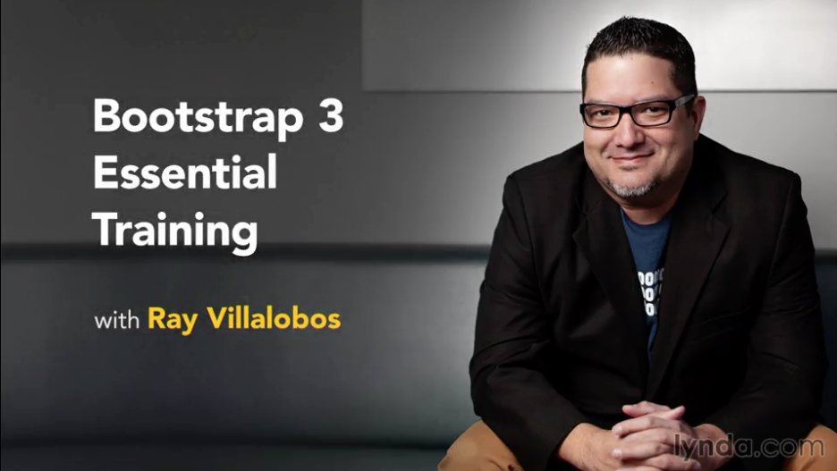

# Bootstrap 3 Essential Training
This is the repository for my course Bootstrap 3 Essential Training. The full course is available on [LinkedIn Learning](https://www.linkedin.com/learning/bootstrap-3-essential-training?trk=insiders_6787408_learning) and [Lynda.com](https://www.lynda.com/Bootstrap-tutorials/Bootstrap-3-Essential-Training)

Bootstrap is a popular framework designed for building responsive, accessible, and mobile-ready websites. An open-source platform using HTML5, CSS3, and jQuery, it features a 12-column grid, icons you can incorporate into your designs, and fully functional JavaScript components that are ready to use.

This course provides everything you need to know to get started building websites with Bootstrap, and is built with our new practice environments in mind, which let you develop your code along with author Ray Villalobos. Ray will review Bootstrap's grid, CSS classes, and JavaScript components (dropdowns, modals, carousels, and more), and help you integrate them into your own sophisticated websites.

## Instructions
This repository has branches for each of the videos in the course. You can use the branch pop up menu in github to switch to a specific branch and take a look at the course at that stage. Or you can simply add `/tree/BRANCH_NAME` to the URL to go to the branch you want to peek at. 

## Branches
The branches are structured so that they correspond to the videos in the course. So, for example if I name a branch `02_03b` then that branch corresponds to the second chapter and the third video in that chapter. The extra letter at the end of the name corresponds to the state of the branch. A `b` means that this is how the code looks at the beginning of the video, an `e` means that is how the code looked at the end of the video.

You may find additional branches that correspod to other states, so for example, you may see a `t`, which means this is a target branch. A target branch is something I use during development or updates of a course and it's for a branch that I'm working towards. For the purposes of taking a course, you may ignore any additional branches. The `master` branch usually has the state of the project as I'm working through it and the final state of the code when I finish the course. 

## Installing
1. Make sure you have these installed
	- [node.js](http://nodejs.org/)
	- [git](http://git-scm.com/)
	- [gulp](http://gulpjs.com/)
2. Clone this repository into your local machine using the terminal (mac) or Gitbash (PC) `> git clone CLONEURL`
3. CD to the folder `cd FOLDERNAME`
4. Run `> npm install` to install the project dependencies
5. Run `> gulp` to start live preview server

## More Stuff
Check out some of my other courses on [LinkedIn Learning](https://www.linkedin.com/learning/instructors/ray-villalobos?trk=insiders_6787408_learning) and [lynda.com](http://lynda.com/rayvillalobos). You can follow me on [LinkedIn](https://www.linkedin.com/in/planetoftheweb/), read [my blog](http://raybo.org), [follow me on twitter](http://twitter.com/planetoftheweb), or check out my [youtube channel](http://youtube.com/planetoftheweb).

# Bootstrap 3: Essential Training
This is the repository for my course, [Bootstrap 3: Essential Training](http://www.lynda.com/Bootstrap-tutorials/Bootstrap-3-Essential-Training/417641-2.html). The full course is available at [lynda.com](http://lynda.com).
- [My Personal Website](http://raybo.org)

## About the course
Bootstrap is a popular framework designed for building responsive, accessible, and mobile-ready websites. An open-source platform using HTML5, CSS3, and jQuery, it features a 12-column grid, icons you can incorporate into your designs, and fully functional JavaScript components that are ready to use.

This course provides everything you need to know to get started building websites with Bootstrap, and is built with our new practice environments in mind, which let you develop your code along with author Ray Villalobos. Ray will review Bootstrap's grid, CSS classes, and JavaScript components (dropdowns, modals, carousels, and more), and help you integrate them into your own sophisticated websites.

## Topics include:

- Understanding containers
- Using the 12-column grid to create a responsive webpage layout
- Creating rows and columns
- Styling content with Bootstrap CSS classes
- Adding CSS styles
- Creating and styling forms
- Creating dropdown menus and buttons
- Adding images and video
- Exploring JavaScript components, like carousels, tabs, tool tips, and scrolling

## Instructions
This repository has branches for each of the videos in the course. You can use the branch pop up menu in github to switch to a specific branch and take a look at the course at that stage. Or you can simply add `/tree/BRANCH_NAME` to the URL to go to the branch you want to peek at.

1. Make sure you have these installed
	- [node.js](http://nodejs.org/)
	- [git](http://git-scm.com/)
	- [gulp](http://gulpjs.com/)
2. Clone this repository into your local machine using the terminal (mac) or Gitbash (PC) `> git clone https://github.com/planetoftheweb/bootstrap.git`
3. CD to the folder `cd bootstrap`
4. Run `> npm install` to install the project dependencies
5. Run `> gulp` command to start the automation
6. Build something awesome

For more help setting up a comprehensive Gulp.js workflow, check out [Web Project Workflows with Gulp.js, Git, and Browserify](http://www.lynda.com/Web-Web-Design-tutorials/Web-Project-Workflows-Gulpjs-Git-Browserify/154416-2.html).

## More Stuff
Check out some of my [other courses on lynda.com](http://lynda.com/rayvillalobos). You can also check out my [youtube channel](http://youtube.com/planetoftheweb), [follow me on twitter](http://twitter.com/planetoftheweb), or read [my blog](http://raybo.org).

## No Images
__Warning:__ These files contain no images, but you can use your own images or use a placeholder website like [placehold.it](http://placehold.it/).
